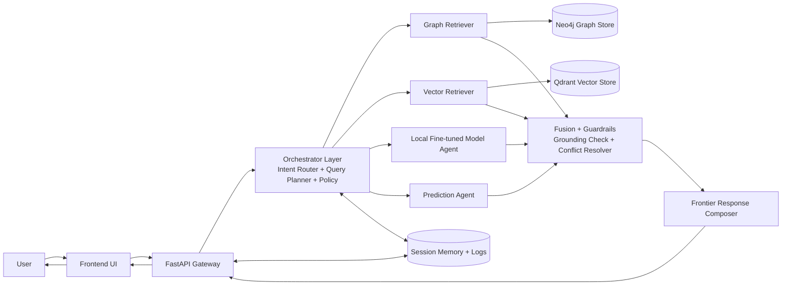
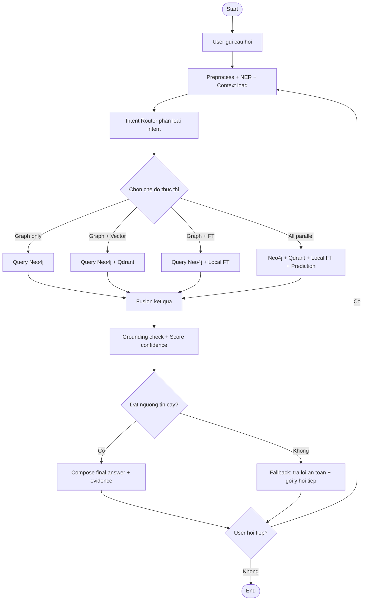
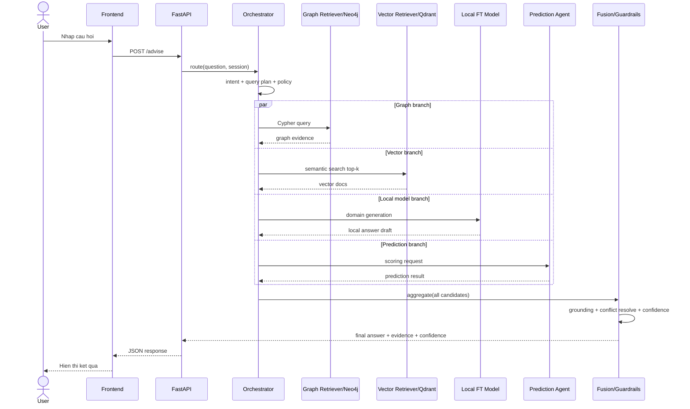
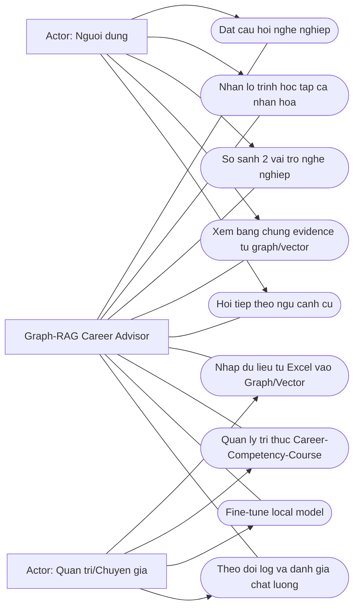

# Graph-RAG System Diagrams

Tai lieu nay tong hop diagram cho he thong Graph-RAG theo huong:
- LLM dieu phoi (Intent Router + Planner)
- Truy van ket hop Neo4j + Qdrant + Local FT Model + Prediction Agent
- Frontier model tong hop ket qua va tra loi grounded

## 1) Architecture Diagram (Component View)

## 2) Activity Diagram (Operational Flow)

## 3) Sequence Diagram (Runtime Interaction)

## 4) Use Case Diagram (UC)

## 5) UC Text Specification (ngan gon)

- UC1 - Dat cau hoi nghe nghiep: User nhap muc tieu, he thong phan tich intent va tra loi.
- UC2 - Nhan lo trinh ca nhan hoa: He thong tong hop roadmap dua tren profile + retrieval.
- UC3 - So sanh vai tro: He thong trich xuat skill-gap giua hai role.
- UC4 - Xem evidence: He thong hien nguon (path graph, tai lieu vector).
- UC5 - Hoi tiep: He thong giu nho context va tiep tuc dong hoi dap.
- UC6 - Nhap du lieu Excel: Admin ETL vao Neo4j + Qdrant.
- UC7 - Quan ly tri thuc: Admin cap nhat quan he Career/Competency/Course.
- UC8 - Fine-tune model: Admin huan luyen local model theo du lieu domain.
- UC9 - Giam sat chat luong: Admin xem log, confidence, ti le fallback.

## 6) PNG Exports (xem truc tiep hinh)

Da render sanh anh PNG tu Mermaid:

- `design/diagrams/architecture.png`
- `design/diagrams/activity.png`
- `design/diagrams/sequence.png`
- `design/diagrams/usecase.png`
