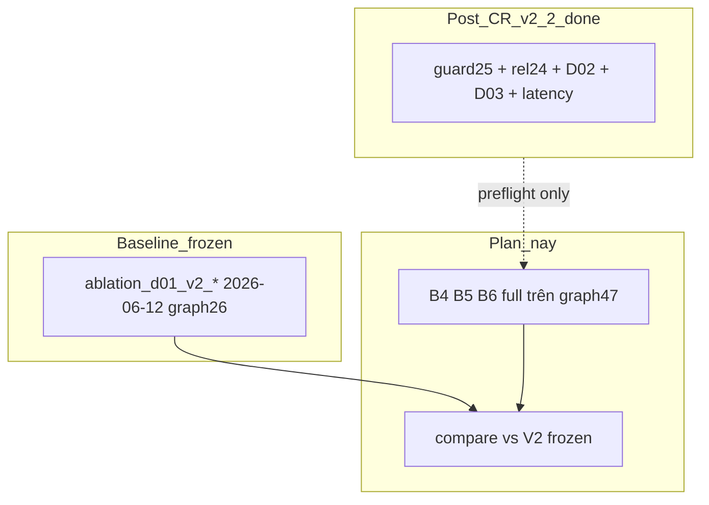

# Plan: D-01 V2 Fusion Rerun (Post-CR graph 47 cạnh)

> **Mục tiêu:** Chạy lại **đủ** thí nghiệm học thuật Phương án B V2 (B4 hint 80 + B5 generative 15 + B6 no-hint 25) trên **trạng thái deploy hiện tại** (Neo4j 47 cạnh, corpus/Qdrant post-enrich), so sánh với baseline V2 đóng băng (`results/ablation_d01_v2_static.json`, snapshot 2026-06-12).
>
> **Khác Post-CR v2.2:** Plan trước chỉ guard 25 case + rel/D-02/D-03. Plan này **không thay thế** baseline V2 — tạo artifact suffix `_v2_r2`.

---

## 1. Bối cảnh & câu hỏi nghiên cứu

| | V2 gốc (2026-06-12) | Rerun này |
|---|---------------------|-----------|
| Neo4j relation edges | ~26 | **47** |
| Coverage career-map | ~7.5% | **~14.6%** |
| Corpus | pre-relation enrich | **669 chunks**, có block `Quan hệ competency` |
| Qdrant | index cũ | **career_roadmap** post-rebuild |
| Gold | `answer_gold_v2*.jsonl` | **cùng file** (không đổi schema) |
| Metric | `--metrics-profile v2` | **giữ nguyên** |

**Câu hỏi rerun trả lời:**

1. Sau competency_relation deploy, **claim fusion V2 còn đúng hướng không?** (Graph* >> Vector; Tight > Late trên no-hint)
2. **Mức thay đổi số** so V2 gốc là bao nhiêu? (delta per mode, per intent)
3. Corpus enrich có **inflate** `vector_only` / `late_fusion` so với graph-only không?

**Không claim trong rerun này:** competency_relation (đã có `answer_gold_rel.jsonl` + Post-CR B2).

---

## 2. Nguyên tắc artifact

- **Không ghi đè:** `results/ablation_d01_v2_static.json`, `..._no_hint.json`, `..._generative.json`
- **Suffix mới:** `_v2_r2` (run 2 trên graph mới)
- **Snapshot:** một `SNAP=YYYY-MM-DD` cho cả 3 run trong cùng session
- **Baseline compare:** `scripts/compare_ablation_runs.py --filter-baseline-to-candidate` (cùng case_id)

---

## 3. Pre-flight (blocking)

Chạy **trước** ablation; fail → dừng.

```bash
# P0 — Gold integrity (offline)
python scripts/validate_gold.py data/eval/answer_gold_v2.jsonl
python scripts/validate_gold.py data/eval/answer_gold_no_hint_v2.jsonl
python scripts/validate_gold.py data/eval/answer_gold_ablation_gen_v2.jsonl

# P1 — Deploy sanity (đã pass Post-CR; xác nhận lại)
python scripts/validate_ingest.py
python scripts/validate_ingest.py --spot-check-neo4j
python scripts/validate_graph_coverage.py --use-neo4j --min-relation-edges 47 --min-coverage 0.14
python scripts/smoke_ablation.py

# P2 — Embed quota (tránh lặp lỗi Post-CR)
# Kiểm tra 1 query embed OK trước khi chạy batch:
python -c "from app.rag.embeddings import EmbeddingClient; e=EmbeddingClient(); print('embed OK' if e.embed(['test']) else 'FAIL')"
```

| Gate | Pass |
|------|------|
| validate_gold ×3 | exit 0 |
| Neo4j 47 + spot-check | exit 0 |
| smoke_ablation | exit 0 |
| embed probe | 1 vector OK |

**Rủi ro embed 429:** Ước tính ~**120** query embed (80+25+15 gold × vector modes, cache Qdrant giảm re-embed corpus). Nếu free tier: **chia 2 ngày** (B4 ngày 1, B6+B5 ngày 2) hoặc nâng quota.

---

## 4. Lệnh chạy (B4 → B6 → B5)

Dùng **cùng** `--snapshot-date` và **không** `--bootstrap-gold` (gold đã enrich offline).

```bash
SNAP=2026-06-XX   # ngày chạy thực tế

# B4 — Hint-mode static 80×4 [BẢNG CHÍNH]
python scripts/run_quality_ablation.py \
  --gold data/eval/answer_gold_v2.jsonl \
  --eval-mode static --metrics-profile v2 \
  --snapshot-date $SNAP \
  --json-out results/ablation_d01_v2_r2_static.json \
  --latex-out results/ablation_d01_v2_r2_static.tex

# B6 — No-hint static 25×4 [CHỨNG MINH TIGHT]
python scripts/run_quality_ablation.py \
  --gold data/eval/answer_gold_no_hint_v2.jsonl \
  --eval-mode static --metrics-profile v2 \
  --snapshot-date $SNAP \
  --json-out results/ablation_d01_v2_r2_no_hint.json \
  --latex-out results/ablation_d01_v2_r2_no_hint.tex

# B5 — Generative subset 15×4 [BẢNG PHỤ E2E]
python scripts/run_quality_ablation.py \
  --gold data/eval/answer_gold_ablation_gen_v2.jsonl \
  --eval-mode generative --metrics-profile v2 \
  --snapshot-date $SNAP \
  --json-out results/ablation_d01_v2_r2_generative.json \
  --latex-out results/ablation_d01_v2_r2_generative.tex
```

**Thứ tự khuyến nghị:** B4 → B6 → B5 (static trước; generative tốn LLM + embed).

**Thời gian ước tính:** 320 bước static + 60 generative ≈ **2–4 giờ** (tùy embed/LLM latency).

---

## 5. So sánh với V2 baseline

Sau mỗi run, compare **paired per case_id + mode**:

```bash
python scripts/compare_ablation_runs.py \
  --baseline results/ablation_d01_v2_static.json \
  --candidate results/ablation_d01_v2_r2_static.json \
  --filter-baseline-to-candidate \
  --out results/ablation_delta_v2_r2_static.json

python scripts/compare_ablation_runs.py \
  --baseline results/ablation_d01_v2_no_hint.json \
  --candidate results/ablation_d01_v2_r2_no_hint.json \
  --filter-baseline-to-candidate \
  --out results/ablation_delta_v2_r2_no_hint.json

python scripts/compare_ablation_runs.py \
  --baseline results/ablation_d01_v2_generative.json \
  --candidate results/ablation_d01_v2_r2_generative.json \
  --filter-baseline-to-candidate \
  --out results/ablation_delta_v2_r2_generative.json
```

### Ngưỡng regression (reuse Post-CR rule)

| Tình huống | Threshold |
|------------|-----------|
| Có `results/regression_variance_v2.json` | stored 2×std |
| Không calibrate | **default 0.02** trên `answer_entity_f1` (ghi trong báo cáo) |

### Gate hướng (directional — không cần p-value)

**B4 hint 80:**

| Check | Kỳ vọng rerun |
|-------|----------------|
| GraphOnly `answer_entity_f1` | >> VectorOnly (giữ thứ tự V2) |
| GraphOnly `ontology_f1` | >> VectorOnly |
| Tight vs Late `ontology_f1` | **Không** yêu cầu Tight > Late (hint đúng) |
| Tight vs Late `answer_entity_f1` | Không over-claim cải thiện lớn |

**B6 no-hint 25:**

| Check | Kỳ vọng rerun |
|-------|----------------|
| Tight `answer_entity_f1` | ≥ Late và ≥ GraphOnly (mean) |
| `summary_by_cypher_matched` Hard | Tight ≥ Graph trên Hard (nếu Hard ≥ 5) |
| Easy subset | Ghi nhận Tight ≈ Graph (seed không đổi) |

**B5 generative 15:** minh họa; Graph >> Vector; không dùng làm gate ship.

---

## 6. Báo cáo mới

**File:** `docs/d01_eval_report_v2_rerun_post_cr.txt`

### Cấu trúc bắt buộc

1. **Tóm tắt** — V2 gốc vs V2 r2 (graph 26→47, corpus enrich)
2. **Pre-flight manifest** — edges, coverage, corpus sha256, qdrant collection, SNAP
3. **Bảng A** — B4 hint 80×4 (4 mode, cột metric v2) — **số tuyệt đối r2**
4. **Bảng A′** — Delta vs V2 gốc (từ compare JSON)
5. **Bảng B** — B5 generative 15×4 (+ cosine nếu có)
6. **Bảng C** — B6 no-hint 25×4
7. **Bảng C-easy / C-hard** — từ `summary_by_cypher_matched`
8. **§ Ảnh hưởng corpus enrich** — Vector/Late có tăng `full_grounding_rate` / giảm `exclusive_graph_rate` không
9. **§ Claim cập nhật** — claim nào giữ, claim nào phải soften
10. **§ Hạn chế** — embed quota, coverage 14.6% < 40%, không gồm rel intent
11. **Lệnh tái tạo** — copy §4–§5

**Snippet LaTeX thesis:** cập nhật hoặc thêm `results/ablation_d01_v2_r2_static.tex` vào báo cáo chính; **giữ** bảng V2 gốc làm historical baseline nếu hội đồng yêu cầu so sánh trước/sau CR.

---

## 7. Deliverables

| Artifact | Path |
|----------|------|
| B4 hint r2 | `results/ablation_d01_v2_r2_static.json` + `.tex` |
| B6 no-hint r2 | `results/ablation_d01_v2_r2_no_hint.json` + `.tex` |
| B5 generative r2 | `results/ablation_d01_v2_r2_generative.json` + `.tex` |
| Delta static | `results/ablation_delta_v2_r2_static.json` |
| Delta no-hint | `results/ablation_delta_v2_r2_no_hint.json` |
| Delta generative | `results/ablation_delta_v2_r2_generative.json` |
| Báo cáo | `docs/d01_eval_report_v2_rerun_post_cr.txt` |
| Failure log | `results/v2_r2_failure_log.json` |

---

## 8. Phân tách với các plan khác



| Plan | Vai trò |
|------|---------|
| D-01 V2 Plan B (đã chạy) | Baseline học thuật **đóng băng** |
| Post-CR v2.2 (đã chạy) | Deploy verify + rel + regression guard 25 |
| **Plan này** | **Fusion rerun đầy đủ** + delta vs V2 |

---

## 9. Checklist thực thi

- [ ] Pre-flight P0–P2 pass
- [ ] B4 80×4 → JSON + LaTeX + compare delta
- [ ] B6 25×4 → JSON + LaTeX + compare delta + easy/hard tables
- [ ] B5 15×4 → JSON + LaTeX + compare delta
- [ ] Viết `docs/d01_eval_report_v2_rerun_post_cr.txt`
- [ ] Ghi `results/v2_r2_failure_log.json` (pass/fail từng gate)
- [ ] Cập nhật 1 đoạn trong `docs/d01_eval_report_v2_methodology.txt` § “Rerun post-CR” (link file mới, **không** sửa bảng số V2 gốc)

---

## 10. Quyết định mở (chọn trước khi chạy)

| # | Câu hỏi | Khuyến nghị |
|---|---------|-------------|
| 1 | Có chạy pilot 3 case Late trước B4? | **Có** — gate Phase 1 V2 (vector append marker) |
| 2 | Generative dùng cùng LLM backend V2? | **Có** — ghi model name trong JSON meta |
| 3 | Thesis dùng bảng nào làm chính? | **V2 r2** nếu deploy 47 cạnh là production; **V2 gốc** + delta footnote nếu muốn conservative |
| 4 | Calibrate threshold 3 pilot? | **Không bắt buộc** — đã có V2 baseline 1 run; dùng Δ + directional gates |
